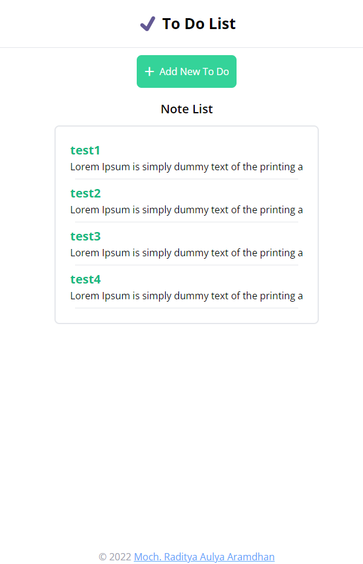

# Todolist Web

### About:

This is a To Do List web using React Js with Vite. User can add the list what they want to do and also the description for detail. User also can edit and delete to do list

### Tech Stack:

* React JS
* TailwindCSS
* NodeJs
* React Router Dom
* React Redux

### Screenshot

<p align="center"></p>

### Software 

Before proceeding, please ensure you have the following software installed on your computer.
* Node
* Git command line tools (Git Bash)

### Useful links
* Deploy (Frontend):
* Deploy (Backend):

## Getting started

Please fork a copy of this repository. Forking a repository allows you to freely experiment with changes without affecting the original project. Alternatively download or clone the master branch.

### Download & Install Dependencies on your machine 

Clone the repo to your machine 

```
git clone https://github.com/Aramdhann/todolist.git
```

### Launch the frontend

1) Open a new terminal window and navigate inside the 'Frontend' folder as you will need to keep the backend running in the background

```
cd ../path/to/Frontend
npm install
```

2) Run the start script

``` 
npm run dev
```

### Launch the backend

1)	Within terminal or cmd ensure you have navigated inside the 'Backend' directory and installed the dependencies

```
cd ../path/to/Backend 
yarn install OR npm install
```

2) Run the start script

``` 
yarn run start OR npm run start
```
